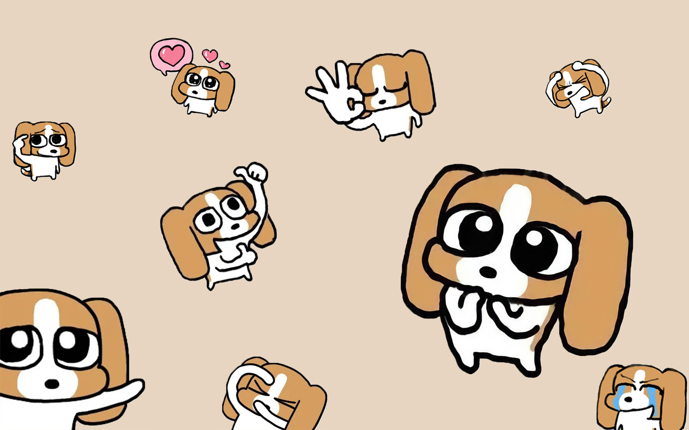

# My Maker Profile
# 我的 Maker 档案

**Name | 姓名**: Minghua Su

**Date | 日期**: 2025.11.21

---

## 👤 About Me | 关于我

### Who am I? | 我是谁？

**My name is | 我的名字是**: Minghua Su

**My hobbies include | 我的爱好包括**: Cycling, programming, photography.

**One interesting thing about me | 关于我的一件有趣的事**: I like film photography

---

## 🎯 Why I'm Here | 为什么来这里

### Why did I join the Making More Makers course? | 为什么参加 Making More Makers 课程？

I joined the Making More Makers course because I want to learn how to turn my ideas into real, working projects.

### What do I hope to gain from this experience? | 我希望从这次经历中获得什么？

I hope to gain practical skills in building and programming maker projects, learn how to use tools like Arduino and sensors effectively, and develop my ability to prototype and iterate on designs. I want to get deeper as a maker.

---

## 💡 My Project Idea | 我的项目想法

### Project Name (if you have one) | 项目名称（如果你有的话）

Smart Plant Monitor (working title)
### What do I want to make? | 我想做什么？

*Describe your project idea in 3-5 sentences*  
*用 3-5 句话描述你的项目想法*

This project act as a auto-fill water bottle on the desk. Instead of filling water from the top, which is inconvenient and takes a lot of space, this project focuses on filling water from the bottom. I planned to make a single way hole at the bottom of the water bottle, which can let water in. There's a base that carries on the bottle, which is connected to a water source (it may be a big water bucket), using water pump to push the water up.

### Why do I want to make this? | 为什么想做这个？

*What problem does it solve? What excites you about it?*  
*它解决什么问题？什么让你对它感到兴奋？*

I want to make a small and simple desk bottle that can help me fill the water once I drank all of the water inside a bottle.

### What technologies or tools might I need? | 我可能需要什么技术或工具？

*It's okay if you're not sure yet!*  
*如果你还不确定，没关系！*

- [√] Arduino
- [ ] ESP32√
- [√] Sensors (which ones?: soil moisture sensor, light sensor, temperature sensor)
- [√] LEDs / Lights
- [√] Motors / Servos
- [√] 3D Printing
- [ ] AI / Machine Learning
- [ ] Other: small display screen or OLED display

---

## 🎓 What I Want to Learn | 我想学什么
3d printing, laser cutting, arduino.
### Skills I want to develop | 我想发展的技能
creativity, communication skills, perseverance.
Rate your current level (1 = beginner, 5 = expert) and what you want to achieve:
3
评估你目前的水平（1 = 初学者，5 = 专家）以及你想达到的水平：

| Skill | Current Level | Target Level |
|-------|--------------|--------------|
| Arduino Programming | ☐1 ☐2 √3 ☐4 ☐5 | ☐1 ☐2 ☐3 √4 ☐5 |
| Circuit Building | ☐1 ☐2 √3 ☐4 ☐5 | ☐1 ☐2 ☐3 √4 ☐5 |
| 3D Design | ☐1 √2 ☐3 ☐4 ☐5 | ☐1 ☐2 √3 ☐4 ☐5 |
| Git/GitHub | ☐1 ☐2 √3 ☐4 ☐5 | ☐1 ☐2 ☐3 √4 ☐5 |
| Documentation | ☐1 ☐2 √3 ☐4 ☐5 | ☐1 ☐2 ☐3 √4 ☐5 |
| Problem Solving | ☐1 ☐2 ☐3 √4 ☐5 | ☐1 ☐2 ☐3 ☐4 √5 |

### One specific thing I want to master | 我想掌握的一件具体事情


---

## 🌟 My Maker Identity | 我的 Maker 身份

### Which Maker principle resonates with me most? | 哪个 Maker 原则最能引起我的共鸣？

*Choose one from: Curiosity, Hands-on, Fail Fast, Iteration, Interdisciplinary, Open Sharing*  
*从以下选择一个：好奇、动手、快速试错、迭代、跨学科、开源分享*

**I choose | 我选择**: 

**Because | 因为**: 


---

## 🎯 My 6-Day Goals | 我的 6 天目标

### What does success look like for me at the end of this course? | 课程结束时，成功对我来说是什么样的？


### Specific goals for each day | 每天的具体目标

- **Day 1**: 
- **Day 2**: 
- **Day 3**: 
- **Day 4**: 
- **Day 5**: 
- **Day 6**: 

---

## 💬 Additional Thoughts | 其他想法

### Is there anything else you'd like to share? | 还有什么想分享的吗？


### Any concerns or questions? | 有任何顾虑或问题吗？


---

## 📸 Optional: Add a Photo! | 可选：添加照片！

*You can add a photo of yourself, your inspiration, or anything that represents you as a Maker*  
*你可以添加你自己的照片、你的灵感来源，或任何代表你作为 Maker 的东西*

```
To add a photo:
1. Upload the image to your repository
2. Use this syntax: 
```

---

## 🚀 My Commitment | 我的承诺

**I commit to | 我承诺**:
- [√] Being curious and asking questions
- [√] Trying things even if I might fail
- [√] Helping my teammates
- [√] Documenting my progress
- [√] Sharing what I learn
- [√] Having fun and being creative!

**Signature | 签名**: Minghua Su

**Date | 日期**: 2025.11.21

---

**From today, I am a Maker!**  
**从今天起，我是一个 Maker！**

---

*This profile is a living document - feel free to update it throughout the course!*  
*这份档案是一个不断更新的文档 - 在整个课程中随时更新它！*

